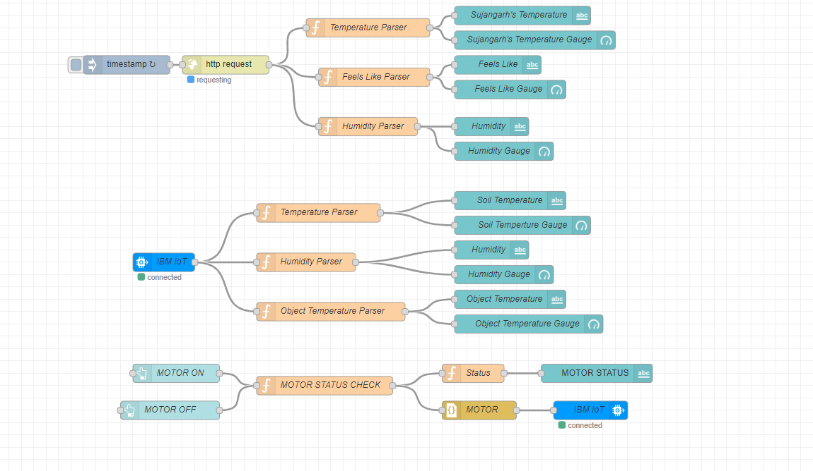

# Smart Agriculture system based on IoT

This is a system which enables farmers to monitor and controL their farms with a web-based application built with Node-RED. It uses IBM Watson cloud platform as its backend.

## Simulated Farm
Data can be collected from farm but in this system I have used simulator for this.

## Soil Data and Weather forcast(OpenWeather API)

Data can be collected from sensors on the farm and data from OpenWeather's API. In this system I have simulated farm data using a virtual platform [here.](https://watson-iot-sensor-simulator.mybluemix.net/)

## Motor Controls

Web App also provides Buttons to control motor equipment on the farm remotely.

## Node-RED program flow

## Virtual Farm command receiver on Python

Commands sent from Node-RED and sent to the cloud and then are read by a Python script running locally to read the command and perform the intended action.

